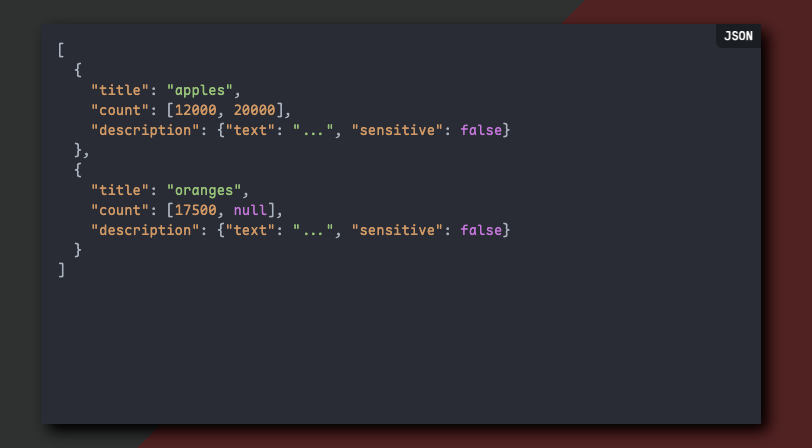
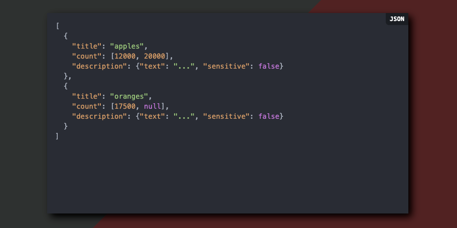

# maple-font-browser-extension

将你的网页代码全部换成Maple mono font

## 代码说明

*   **`manifest.json`:**
    *   定义了插件的名称、版本、描述、权限和内容脚本等信息。
    *   `content_scripts` 部分指定了在所有网页上运行的 `content.js` 文件。
*   **`content.js`:**
    *   创建 `<link>` 元素，将 Maple Mono CN 字体 CSS 文件从 CDN 引入。
    *   创建 `<style>` 元素，覆盖 `code`、`pre`、`kbd` 和 `samp` 元素的 `font-family` 属性，使用 `Maple Mono CN` 字体。

    

## 截图

### 使用后

### 使用前
